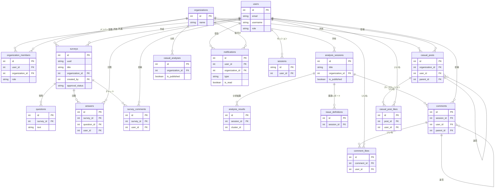

# データベース設計書

本システムは、主要なデータストアとして **PostgreSQL** を使用しています。
また、予測・分析データの一部はCSVファイルとして管理されています。

## ER図 (Entity Relationship Diagram)

Mermaidコード（参考）

## 1. ユーザー管理

### ユーザーテーブル (`users`)
システムへのアクセス権限とユーザープロファイルを管理します。

| カラム名 | 型 | 説明 |
| :--- | :--- | :--- |
| `id` | Integer | ユーザーの一意なID (主キー)。 |
| `email` | String | メールアドレス (ログインID, 一意)。 |
| `username` | String | ユーザーの表示名 (旧name)。 |
| `password_hash` | String | Bcryptでハッシュ化されたパスワード。 (ポリシー: 8文字以上, 英数字混在) |
| `role` | String | システム権限: 'system_admin' (システム管理者) または 'system_user' (一般/組織管理者)。※組織ごとの詳細な権限は `organization_members` テーブルで管理。 |
| `must_change_password` | Boolean | 初回パスワード変更強制フラグ。 |
| `reset_token` | String | パスワードリセット用の一時トークン。 |
| `reset_token_expiry` | DateTime | トークンの有効期限。 |

### 組織テーブル (`organizations`)
プロジェクトや部門単位の「組織」を管理します。

| カラム名 | 型 | 説明 |
| :--- | :--- | :--- |
| `id` | Integer | 組織ID (主キー)。 |
| `name` | String | 組織名 (一意)。 |
| `description` | Text | 説明。 |
| `created_at` | DateTime | 作成日時。 |

### 組織メンバー (`organization_members`)
ユーザーと組織の紐付けおよび組織内ロールを管理します。

| カラム名 | 型 | 説明 |
| :--- | :--- | :--- |
| `id` | Integer | ID (主キー)。 |
| `user_id` | Integer | ユーザーID (外部キー)。 |
| `organization_id` | Integer | 組織ID (外部キー)。 |
| `role` | String | 組織内ロール: 'admin' (組織管理者) または 'general' (一般)。 |
| `joined_at` | DateTime | 加入日時。 |

### セッションテーブル (`sessions`)
ユーザーのログインセッションを管理します。`auth.py` によりログイン時にレコードが作成され、Cookie (`small_voice_session`) と紐付けられます。

| カラム名 | 型 | 説明 |
| :--- | :--- | :--- |
| `id` | String | セッションID (Random URL-safe string)。Cookieに保存されるトークン。 (主キー)。 |
| `user_id` | Integer | 紐付くユーザーID (外部キー)。 |
| `created_at` | DateTime | 作成日時。 |
| `expires_at` | DateTime | 有効期限 (作成から7日間)。 |

## 2. 分析データソース (CSV)

以下のデータはデータベースのテーブルではなく、CSVファイルとして `outputs/test_data/` 配下に生成・管理され、アプリケーション起動時に読み込まれます。

*   **Project (`project.csv`)**: プロジェクト管理・開発プロセスに関するフィードバック
*   **Tech Quality (`tech_quality.csv`)**: 技術負債やコード品質に関するデータ
*   **Dev Env (`dev_env.csv`)**: 開発環境（ツール、インフラ）に関するアンケートデータ
*   **Values (`values.csv`)**: 組織文化・価値観に関するデータ

## 3. 分析セッション機能

### 分析セッション (`analysis_sessions`)
AI分析の実行単位（セッション）を管理します。

| カラム名 | 型 | 説明 |
| :--- | :--- | :--- |
| `id` | Integer | セッションID (主キー)。 |
| `title` | String | レポート名。 |
| `theme` | String | 分析対象テーマ（カラム名など）。 |
| `created_at` | DateTime | 作成日時。 |
| `organization_id` | Integer | 紐付く組織ID (外部キー)。 |
| `is_published` | Boolean | 一般ユーザーへの公開状態。 |
| `comment_analysis` | Text | チャットコメントのAI分析結果。 |
| `is_comment_analysis_published` | Boolean | コメント分析結果の公開状態。 |

### 分析結果 (`analysis_results`)
セッションごとの個別の分析結果（1レコードごとの分析）を格納します。

| カラム名 | 型 | 説明 |
| :--- | :--- | :--- |
| `id` | Integer | ID (主キー)。 |
| `session_id` | Integer | 紐付く分析セッションID (外部キー)。 |
| `original_text` | Text | 分析元のテキストデータ。 |
| `sub_topic` | String | AIが判定したカテゴリ/サブトピック。 |
| `summary` | String | テキストの要約。 |
| `x_coordinate` | Float | クラスタリング可視化用のX座標。 |
| `y_coordinate` | Float | クラスタリング可視化用のY座標。 |
| `cluster_id` | Integer | 所属するクラスタID（-1はノイズ）。 |

### 課題定義レポート (`issue_definitions`)
セッション全体を通してAIが生成した課題レポートを格納します。

| カラム名 | 型 | 説明 |
| :--- | :--- | :--- |
| `id` | Integer | ID (主キー)。 |
| `session_id` | Integer | 紐付く分析セッションID (外部キー)。 |
| `content` | Text | AI生成レポートのMarkdownテキスト。 |

### コメント/チャット (`comments`)
分析レポートに対するユーザーからのフィードバックや議論を格納します。

| カラム名 | 型 | 説明 |
| :--- | :--- | :--- |
| `id` | Integer | ID (主キー)。 |
| `session_id` | Integer | 紐付く分析セッションID (外部キー)。 |
| `user_id` | Integer | 投稿者ID (外部キー)。 |
| `content` | Text | 投稿内容。 |
| `is_anonymous` | Boolean | 匿名投稿フラグ。 |
| `created_at` | DateTime | 投稿日時。 |
| `parent_id` | Integer | 親コメントのID (リプライ時)。 |
| `updated_at` | DateTime | 最終更新日時 (編集時)。 |

### コメントいいね (`comment_likes`)
コメントに対する「いいね」データを管理します。

| カラム名 | 型 | 説明 |
| :--- | :--- | :--- |
| `id` | Integer | ID (主キー)。 |
| `comment_id` | Integer | 紐付くコメントID (外部キー)。 |
| `user_id` | Integer | いいねしたユーザーID (外部キー)。 |
| `created_at` | DateTime | 作成日時。 |

## 4. アンケート機能

### アンケート定義 (`surveys`)
作成されたアンケートフォームの定義情報です。

| カラム名 | 型 | 説明 |
| :--- | :--- | :--- |
| `id` | Integer | ID (主キー)。 |
| `uuid` | String | 公開用URLに使用されるUUID。 |
| `title` | String | アンケートタイトル。 |
| `description` | Text | 説明文。 |
| `is_active` | Boolean | 回答受付中かどうか。 |
| `created_at` | DateTime | 作成日時。 |
| `updated_at` | DateTime | 最終更新日時。 |
| `created_by` | Integer | 作成者ID (外部キー)。 |
| `organization_id` | Integer | 紐付く組織ID (外部キー)。 |
| `source` | String | データソース ('manual', 'request', 'csv' 等)。 |
| `approval_status` | String | 承認ステータス ('pending', 'approved', 'rejected')。 |
| `rejection_reason` | Text | 却下理由。 |

### 設問 (`questions`)
アンケート内の各質問項目です。

| カラム名 | 型 | 説明 |
| :--- | :--- | :--- |
| `id` | Integer | ID (主キー)。 |
| `survey_id` | Integer | 紐付くアンケートID (外部キー)。 |
| `text` | String | 質問文。 |
| `order` | Integer | 表示順序。 |
| `is_required` | Boolean | 回答必須フラグ (True=必須)。 |

### 回答 (`answers`)
ユーザーからの回答データです。

| カラム名 | 型 | 説明 |
| :--- | :--- | :--- |
| `id` | Integer | ID (主キー)。 |
| `survey_id` | Integer | 紐付くアンケートID (外部キー)。 |
| `question_id` | Integer | 紐付く質問ID (外部キー)。 |
| `user_id` | Integer | 回答者ID (外部キー)。未ログイン時はNULL。 |
| `content` | Text | 回答内容。 |
| `created_at` | DateTime | 回答日時。 |

### アンケートコメント (`survey_comments`)
アンケート申請フォームに対するチャットコメントを管理します。

| カラム名 | 型 | 説明 |
| :--- | :--- | :--- |
| `id` | Integer | ID (主キー)。 |
| `survey_id` | Integer | 紐付くアンケートID (外部キー)。 |
| `user_id` | Integer | 投稿者ID (外部キー)。 |
| `content` | Text | コメント内容。 |
| `created_at` | DateTime | 投稿日時。 |

## 5. 雑談掲示板機能

### 雑談投稿 (`casual_posts`)
みんなの雑談掲示板への投稿を管理します。返信機能（スレッド形式）もサポートしています。

| カラム名 | 型 | 説明 |
| :--- | :--- | :--- |
| `id` | Integer | ID (主キー)。 |
| `organization_id` | Integer | 紐付く組織ID (外部キー)。 |
| `user_id` | Integer | 投稿者ID (外部キー)。削除時はNULL。 |
| `parent_id` | Integer | 親投稿ID (外部キー)。返信時に使用。 |
| `content` | Text | 投稿内容。 |
| `created_at` | DateTime | 投稿日時。 |
| `likes_count` | Integer | いいね数（キャッシュフィールド）。 |

### 雑談いいね (`casual_post_likes`)
雑談投稿に対する「いいね」データを管理します。

| カラム名 | 型 | 説明 |
| :--- | :--- | :--- |
| `id` | Integer | ID (主キー)。 |
| `post_id` | Integer | 紐付く投稿ID (外部キー)。 |
| `user_id` | Integer | いいねしたユーザーID (外部キー)。 |
| `created_at` | DateTime | 作成日時。 |

### 雑談分析結果 (`casual_analyses`)
雑談掲示板の投稿内容から生成されるAI分析・推奨レポートです。

| カラム名 | 型 | 説明 |
| :--- | :--- | :--- |
| `id` | Integer | ID (主キー)。 |
| `organization_id` | Integer | 紐付く組織ID (外部キー)。 |
| `created_at` | DateTime | 作成日時。 |
| `start_date` | DateTime | 分析対象期間の開始日時。 |
| `end_date` | DateTime | 分析対象期間の終了日時。 |
| `result_json` | Text | 分析結果のJSON文字列。 |
| `is_published` | Boolean | 一般ユーザーへの公開状態。 |

## 6. 通知機能

### 通知 (`notifications`)
ユーザーへの通知を管理します。

| カラム名 | 型 | 説明 |
| :--- | :--- | :--- |
| `id` | Integer | ID (主キー)。 |
| `user_id` | Integer | 通知先ユーザーID (外部キー)。 |
| `organization_id` | Integer | 紐付く組織ID (外部キー)。NULL可。 |
| `type` | String | 通知タイプ ('survey_released', 'report_published', 'casual_suggestion', 'chat_new', 'form_rejected', 'form_applied')。 |
| `title` | String | 通知のタイトル。 |
| `content` | Text | 通知の本文。 |
| `link` | String | 通知から遷移するリンクURL。 |
| `is_read` | Boolean | 既読フラグ。 |
| `created_at` | DateTime | 作成日時。 |
